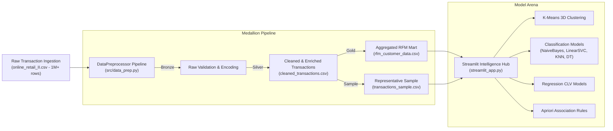

# 🛍️ Customer Intelligence AI & Predictive Segmentation Platform

[](https://python.org)
[](https://streamlit.io)
[](https://scikit-learn.org)
[](https://plotly.com)
[]()

> **Enterprise-grade Customer Analytics, 3D RFM Behavioral Clustering, Customer Lifetime Value (CLV) Regression, Repeat-Purchase Classification, and Market Basket Recommender built with Python and Streamlit.**

---

## 📌 Executive Summary

Modern retail businesses generate millions of transactional records, but converting raw invoices into actionable retention strategies requires robust end-to-end data engineering and predictive modeling. 

This platform processes over **1,000,000+ raw transactions** from the **Online Retail II** dataset, cleanses anomalies through an automated **Medallion Architecture**, engineers **Recency, Frequency, and Monetary (RFM)** dimensions, and delivers production-grade machine learning models to maximize customer lifetime value, combat churn, and uncover cross-selling opportunities.

---

## 🚀 Key Modules & Capabilities

### 1. 📊 Executive KPIs & Business Analytics
- **Top-Line Metrics**: Real-time revenue tracking, unique verified account counts, average monetary spend, and repeat purchase rates.
- **Dynamic Cohort Visualizations**: Interactive scatter plots examining spend velocity vs. order frequency, and recency decay curves.
- **Geographic & Temporal Trends**: Top international market revenue breakdowns and transaction distribution heatmaps across morning, afternoon, and evening windows.

### 2. 👥 3D Customer Segmentation (K-Means Clustering)
- **Interactive 3D Feature Space**: Explore customer clusters across normalized **Recency (R)**, **Frequency (F)**, and **Monetary (M)** axes.
- **Cluster Diagnostics**: Real-time Silhouette score evaluation, Inertia / Elbow calculation, and customer cluster count distribution.
- **Persona Playbooks**: Automated archetype labeling (e.g., *Champions*, *Loyalists*, *At-Risk*, *Hibernating*) with actionable business intervention recommendations.

### 3. 🔮 Live Predictive AI Simulator
- **Interactive What-If Scoring**: Sliders to simulate custom recency and spend scenarios for any hypothetical customer account.
- **Multi-Model Scoring**: Instant prediction of repeat purchase probability, churn risk classification, and expected future revenue contribution.

### 4. 🛒 Market Basket Recommender (Association Rules)
- **Apriori Algorithm Implementation**: High-performance itemset mining based on frequent co-purchases.
- **Actionable Metrics**: Computes **Support**, **Confidence**, and **Lift** to discover strong product association patterns.
- **Interactive Recommender**: Select any product catalog item to instantly generate bundle deals and checkout upsell suggestions.

### 5. 🧠 Machine Learning Arena
- **Comprehensive Benchmarking**: Head-to-head comparison of multiple ML algorithms:
  - **Classification (Return vs. One-Time)**: Naive Bayes, Decision Trees, Linear SVM (with probability calibration), and K-Nearest Neighbors (KNN).
  - **Regression (CLV Prediction)**: Linear Regression, Ridge, Random Forest Regressor.
  - **Ensemble & Advanced**: Stacking/voting ensembles and PCA-reduced neural network embeddings.
- **Model Telemetry**: Confusion matrices, Precision, Recall, F1-Score, ROC-AUC, Log Loss, and training execution times.

### 6. ⚙️ Data Engineering & Medallion Pipeline
- **Bronze Layer (Raw Ingestion)**: Ingestion of large multi-megabyte CSVs with encoding auto-detection (ISO-8859-1 / UTF-8).
- **Silver Layer (Cleaning & Enrichment)**:
  - Strips cancelled orders (`C` prefix invoices).
  - Filters negative/zero quantities and unit prices.
  - Drops rows lacking Customer IDs and deduplicates identical records.
  - Feature engineering: Extracts transaction hour, day name, month, and shopping time-of-day segments.
- **Gold Layer (RFM Feature Mart)**: Aggregates transactional data into verified customer account profiles.
- **Zero-Crash Architecture**: Dual data source input (browser upload or direct zero-overhead local disk read from `data/raw/`), safe in-memory staging before disk persistence, and automated sample generation (`transactions_sample.csv`).

---

## 🏗️ System Architecture



---

## 📁 Repository Structure

```text
CustomerSeg/
│
├── .streamlit/
│   └── config.toml                  # Streamlit server limits (500MB upload support)
│
├── data/
│   ├── raw/                         # Raw retail transactions (e.g. online_retail_II.csv)
│   └── processed/
│       ├── cleaned_transactions.csv # Silver layer cleansed transactions
│       ├── rfm_customer_data.csv    # Gold layer customer-level RFM features
│       └── transactions_sample.csv  # 25,000-row representative dataset for high-speed EDA
│
├── notebooks/                       # Research, exploratory analysis & modeling experiments
│   ├── 01_comprehensive_eda.ipynb
│   ├── 02_regression_analysis.ipynb
│   ├── 03_classification_analysis.ipynb
│   ├── 04_clustering_association.ipynb
│   ├── 05_pca_neural_networks.ipynb
│   └── 06_ensemble_evaluation.ipynb
│
├── src/
│   ├── __init__.py
│   ├── data_prep.py                 # Core Medallion data engineering pipeline
│   └── models/
│       ├── __init__.py
│       ├── advanced.py              # Neural network embeddings & PCA
│       ├── classification.py        # Supervised customer classifiers
│       ├── clustering.py            # K-Means clustering analysis
│       ├── ensemble.py              # Stacking and ensemble models
│       ├── regression.py            # Sales & CLV regression models
│       └── rules.py                 # Market basket association rule mining
│
├── tests/
│   └── test_pipeline.py             # Automated unit tests
│
├── requirements.txt                 # Application dependencies
├── streamlit_app.py                 # Main interactive Streamlit application
└── README.md                        # Documentation
```

---

## ⚡ Quick Start & Local Installation

### 1. Prerequisites
- Python 3.10, 3.11, or 3.12
- Git

### 2. Clone the Repository
```bash
git clone https://github.com/Pawan1618/predictiveAnalysis.git
cd predictiveAnalysis
```

### 3. Create and Activate Virtual Environment
```bash
# Windows
python -m venv .venv
.venv\Scripts\activate

# macOS / Linux
python3 -m venv .venv
source .venv/bin/activate
```

### 4. Install Dependencies
```bash
pip install -r requirements.txt
```

### 5. Launch the Streamlit Dashboard
```bash
streamlit run streamlit_app.py
```
Open your browser and navigate to `http://localhost:8501`.

---

## ☁️ Deployment on Streamlit Community Cloud

This repository is optimized for one-click deployment on **Streamlit Community Cloud**:

1. Fork or push this repository to your GitHub account.
2. Go to [share.streamlit.io](https://share.streamlit.io/) and log in with GitHub.
3. Click **"New app"** and select:
   - **Repository**: `YourUsername/predictiveAnalysis`
   - **Branch**: `main`
   - **Main file path**: `streamlit_app.py`
4. Click **Deploy!**

> **Note on Cloud Limits**: Streamlit Cloud enforces a 1 GB RAM quota. This application automatically utilizes the pre-aggregated Gold RFM mart (`rfm_customer_data.csv`) and the 25,000-row sample (`transactions_sample.csv`), guaranteeing low latency and near-zero memory pressure without exceeding cloud resource caps.

---

## 📊 Dataset Reference

- **Source**: [UCI Machine Learning Repository — Online Retail II](https://archive.ics.uci.edu/dataset/502/online+retail+ii)
- **Timeframe**: December 2009 to December 2011
- **Domain**: Non-store online retail based in the United Kingdom
- **Raw Volume**: 1,067,371 records across 8 transaction attributes

---

## 📜 License

This project is open source and available under the [MIT License](LICENSE).
